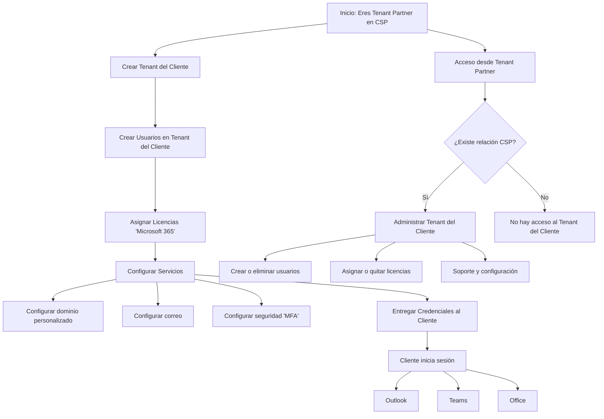
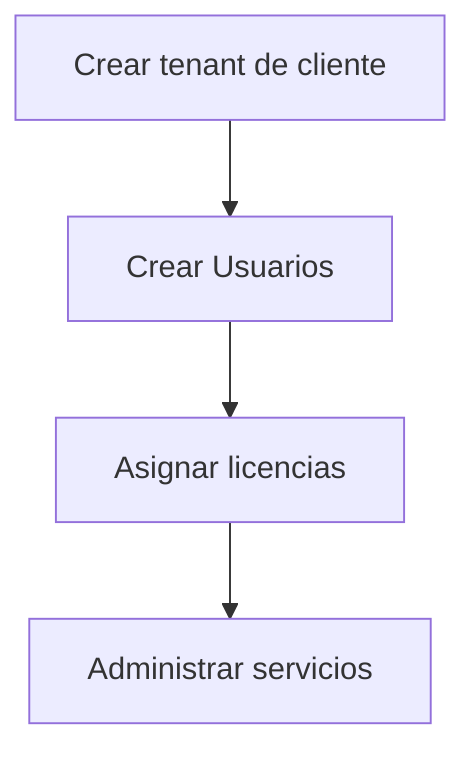

# Microsoft CSP

Microsoft Cloud Solution Provider: "Proveedor de soluciones en la nube de Microsoft", Microsoft delega en (partners) la venta y gestión de sus productos en la nube.

## TENANT

Es como una "empresa digital" del cliente Microsoft, en otras palabras es una nube privada donde una empresa alberga toda su información.

:old_key: *¿Que es relación CSP?*
Es el permiso oficial que un cliente le da a un partner para:

* Administrar su TENANT.
* Venderle licencias.
* Darle soporte.

Esta relación se crea mediante un enlace que generamos y el cliente acepta (DAP "Acceso completo", GDAP "Acceso limitado").
Sin esta relación el cliente es el encargado de todo se auto administra.

### Usuarios y Licencias

Dentro de un tenant existen los usuarios los cuales representan a una persona real y las licencias son las que habilitan funciones.

👉 Tenant → contiene → Usuarios
 👉 Usuario → necesita → Licencia
 👉 Licencia → da acceso → Servicios

## OPERACION

:old_key: *Cliente*
Cuando creamos un cliente definimos:

* Nombre de la empresa
* Dominio inicial (ej: cliente.onmicorosoft.com)
* Pais/región.

:old_key: *Administración*
Aquí comienza el valor real.

* Resetear contraseñas
* Crear más usuarios
* Configurar seguridad
* Soporte al cliente

## SUCRIPCIONES

Es la forma en la que el cliente paga por los servicios como Microsoft 365.
(No se compran licencias sueltas, compras suscripciones que contienen licencias)

:old_key: *Tipos de suscripción*

* Mes a Mes (Mas cara):
  Clientes pequeños o cambiantes.
  * Agregar usuarios.
  * Quitar usuarios.
  * Cancelar.
* Anual (Mas barata), el cliente se compromete por un año.
  Empresas estables.
  * Aumentar licencias
  * No puede reducir fácilmente las licencias.

  :warning: Problemas reales a enfrentar

- Cliente quiere cancelar licencias anuales
  - No se puede fácilmente, ya hay compromiso. 

* Cliente deja de pagar
  * Tú igual debes pagar a microsoft, aquí el riesgo de csp.
* Cliente quiere bajar licencias
  * Mensual -> si
  * Anual -> no (o muy limitado)

## SERVICIOS EN LA NUBE

* Productividad
  * Microsoft 365 -> correos, Word, Excel, Teams
* Infraestructura
  * Azure -> servidores, base de datos, redes
* Negocio (ERP / CRM) "**[ERP](https://www.google.com/search?client=firefox-b-d&q=ERP&ved=2ahUKEwihjIP5sqeUAxV5STABHX1_MsUQgK4QegQIARAC)** (gestión financiera, operaciones) y **[CRM](https://www.google.com/search?client=firefox-b-d&q=CRM&ved=2ahUKEwihjIP5sqeUAxV5STABHX1_MsUQgK4QegQIARAD)** (ventas, atención al cliente)"
  * Dynamics 365 -> CRM y ERP

## LICENCIAS

:old_key: *Reasignación*

Cuando se compra una suscripción. se debe especificar el numero de licencias que se requiere en función de cuantos usuarios presenta la organización. y a continuación asignar una licencia a cada persona. estas se pueden reasignar en caso de que alguien deje la organización.

:old_key: *Combinables*

Un usuario puede contener mas de una licencia, es decir si este tiene presente 365 y requiere de un complemento como Visio, entonces se compra esta licencia y se le asigna, con esto ya tendría dos licencias activas al mismo tiempo.

:old_key: *Cantidad de instalaciones*

Se pueden tener 15 dispositivos conectados simultáneamente divididos por categorías (5 PCs o Macs, 5 Tabletas y 5 Teléfonos). Esto no si los dispositivos esta activos al mismo tiempo, si hay un sexto dispositivo el sistema solicitara que desactive uno de los anteriores para dar espacio al nuevo.

Estos son los tipos de licencia a los que aplica esta regla, tener encuentra que los productor que contienen la `A` son del sector educativo, colegios y universidades:

**Sector Empresarial (Negocios y Empresas)**

* **Empresa Estándar y Premium:**
  El combo completo de servicios (Correo, Teams, Seguridad)
  * Aplicaciones de Microsoft 365 para negocios
  * Aplicaciones de Microsoft 365 para empresas
* **Aplicaciones para negocios/empresas:**
  Versiones que solo incluyen programas instalables (Word, Excel, etc). sin necesaria mente tener correo de microsoft.
  * Microsoft 365 Empresa Estándar
  * Microsoft 365 Empresa Premium
* **Series E3 y E5:**
  Versiones de "Enterprise" para empresas muy grandes con seguridad avanzada.
  * Microsoft 365 E3
  * Microsoft 365 E5
  * Office 365 E3
  * Office 365 E5

  **Sector Educativo (Académico)**

* **A3 y A5:**
  Para instituciones que compran licencias para sus empleados y alumnos.

  - Microsoft 365 A3

  - Microsoft 365 A5
  - Office 365 A3
  - Office 365 A5

* **A1 Plus**
  Una versión especial que regala Microsoft a instituciones que cumplen ciertos requisitos, permitiendo también la instalación en dispositivos.

  * Office 365 A1 Plus

  (2 y 3 de junio de 2026). *Microsoft Build 2026*. Microsoft. [URL](https://learn.microsoft.com/es-es/microsoft-365/commerce/licenses/subscriptions-and-licenses?view=o365-worldwide&utm_source=chatgpt.com)

## SEGURIDAD Y CONTROL

:old_key: *TIPOS DE ACCESO*

* Delegated Admin Privileges (DAP)
  * Tienes acceso casi total al tenant del cliente
  * Es como tener "llaves maestras"
  * Menos seguro
* Granular Delegated Admin Privileges (GDAP)
  * Acceso limitado y controlado
  * Solo a lo que necesites
  * Mas seguro
  * Con tiempo definido (expira)

Como CSP se tiene acceso a muchos tenants.

:warning: Si no controlamos bien

* Acceso indebido
* Errores masivos
* Problemas de seguridad

:ok: Buena practica

* Usar GDAP no DAP, Acceso limitado y controlado.

* MFA, siempre activo.
* Cuentas separadas, una para administración y otra para uso diario.
* Principio de mínimo privilegio, solo acceso a lo necesario.

:fire: Roles

* Administrador global (mucho poder)
* Administrador de usuarios
* Administrador de licencias

:fire: GDAP (para CSP)

Dentro del programa MCSP

* Solo a lo necesario
* Por tiempo limitado

## HERRAMIENTAS

### Microsoft Partner Center

Es una plataforma de software en la nube que sirve como el portal principal para los socios de microsoft, permite a las organizaciones gestionar su relación con microsoft, acceder a programas de asociación, vender soluciones a clientes y supervisar el rendimiento comercial en el ecosistema de partners.

:old_key: *Áreas de trabajo/características*

* :mag: [Configuración de la cuenta](https://learn.microsoft.com/es-es/partner-center/account-settings/partner-center-account-setup) | accont settings
  Vea y edite la configuración de la cuenta, incluido el perfil de la empresa, la información bancaria, los usuarios y los permisos.

* :mag: [Centro de actividades](https://learn.microsoft.com/es-es/partner-center/action-center/action-center-overview) | Action center
  Campana > go to Action Center.
  Vea todas las acciones y notificaciones del centro de partners y administre preferencias como la información de contacto.

* :mag: [Asistente para IA (version preliminar)](https://learn.microsoft.com/es-es/partner-center/enroll/ai-assistant-overview) | AI assistant

  Panel superior derecho > icono de estrellas
  Obtenga información personalizada y recomendaciones para ayudarle a crecer su negocio.

* :mag: [APIs](https://learn.microsoft.com/es-es/partner-center/developer/) | 
  Acceda a las API del centro de partners y administre para integrarla con los sistemas y automatizar las tareas.

* :mag: [Beneficios](https://learn.microsoft.com/es-es/partner-center/manage-your-partner-network-benefits) | Benefits
  Acceda a las ventajas del programa microsoft AI Clous Partner Program y active sus ventajas para ayudarle a crear y crecer su negocio.

* :mag: [Facturación](https://learn.microsoft.com/es-es/partner-center/billing/billing) | Billing
  Acceda a las facturas y descargue los archivos de conciliación.4

* :mag: [Clientela](https://learn.microsoft.com/es-es/partner-center/customers/connect-with-your-customers) | Customers
  Conéctese con los clientes, compre suscripciones, administre licencias y envíe solicitudes de soporte técnico en su nombre.

* :mag: [Ganancias](https://learn.microsoft.com/es-es/partner-center/earnings/earnings-overview) |
  Proporciona informacióna e informes detallados sobre las ganancias, los pagos y los detalles de conciliación asociados para todos los programas de incentivos, Microsoft Marketplace y los programas de la tienda compatibles con el centro de partners. también muestra el resultado de elegibilidad de ingresos y uso para los incentivos comerciales de Microsoft.

* :mag: [Ayuda y soporte técnico](https://learn.microsoft.com/es-es/partner-center/support/support-from-microsoft) | 
  Obtenga actualizaciones de estado del servicio, lea artículos de soporte técnico, póngase en contacto con el soporte técnico, programe cits de soporte técnico y administre sus solicitudes de soporte técnico.

* :mag: [Incentivos](https://learn.microsoft.com/es-es/partner-center/incentives/incentives-get-started-intro) | incentives
  Explore los programas de incentivos, regístrese y administre incentivos y vea sus programas y pagos.

* :mag: [Información](https://learn.microsoft.com/es-es/partner-center/insights/insights-overview) | insights
  Consulte datos sobre sus clientes y sus compras, y obtenga información sobre cómo hacer crecer su negocio.

* :mag: [Ofertas de marketplace](https://learn.microsoft.com/es-es/partner-center/marketplace-offers/) | [Marketplace offers](https://learn.microsoft.com/es-es/marketplace/index)
  Cree, publique y administre soluciones en microsoft marketplace (incluida la nueva categoría de aplicaciones y agentes de IA) y el programa Microsoft 365 y Copilot.

* :mag: [Membresía](https://learn.microsoft.com/es-es/partner-center/membership/mpn-overview) | [Membership](https://learn.microsoft.com/es-es/partner-center/enroll/overview)
  Inscriba y administre competencias, pertenencias y programas del programa microsoft AI Cloud Partner Para ayudarle a comercializar. 

* :mag: [Precios](https://learn.microsoft.com/es-es/partner-center/pricing/pricing-and-offers) | Pricing
  Vea y descargue la información de precios de diferentes ofertas, SKU y paquetes de productos.

* :mag: [Referencias](https://learn.microsoft.com/es-es/partner-center/referrals/referrals) | Referrals
  Descubra y administre clientes potenciales y oportunidades de venta conjunta para separar su negocio.

* [Seguridad](https://learn.microsoft.com/es-es/partner-center/security/overview) |
  Administre la configuración de seguridad, revise las ofertas de seguridad y acceda a los recursos relacionados con la seguridad para proteger la cuenta y los datos.

## DOCUMENTACION PARTNER CENTER

:lock: *Programas de pertenencia*

Los programas de pertenecía son paquetes de beneficios que Microsoft te vende a ti (como socio) a un precio muy reducido para que tengas todo lo necesario para montar tu "taller" tecnológico. no para venderlas si no para que tu y tu equipo las usen.

* Ventajas de lanzamiento (Partner Launch Benefits): Es el nivel inicial. Ideal si estas empezando solo o con un equipo muy pequeño. Te da lo básico para que tu oficina digital funcione con herramientas profesionales.
* Ventajas Principales de Éxito (Success Core): Es un nivel intermedio. Te da más cantidad de licencias y herramientas de soporte técnico.

