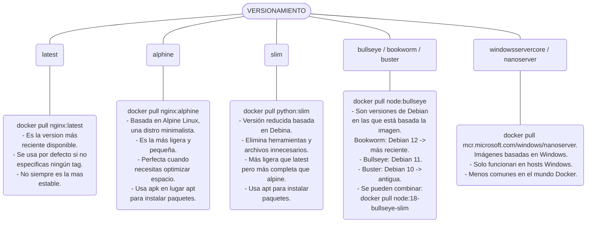

# DOCKER

Docker es una plataforma que permite **crear, distribuir y ejecutar aplicaciones en contenedores**. Un contenedor es una unidad de software que empaqueta el código de una aplicación junto con todas sus dependencias, asegurando que funcione de manera consistente en cualquier entorno.

### 🔹 **¿Que problema soluciona?**

Alguna vez escuchaste "En mi máquina funciona perfectamente", Eso ocurre porque cada computadora tiene diferente sistema operativo, versiones de librería, configuraciones... y una aplicación que funciona en una maquina puede fallar en otra.

### 🔹 **¿Para qué sirve Docker?**

- Evita problemas de "en mi máquina funciona, pero en el servidor no".
- Facilita el despliegue y la escalabilidad de aplicaciones.
- Reduce los conflictos entre dependencias de diferentes aplicaciones.
- Permite correr múltiples aplicaciones en un mismo servidor sin interferencias.

### 🔹 **Conceptos clave de Docker**

1. **Imagen** 📦: Una plantilla que contiene el sistema operativo y la aplicación.

2. **Contenedor** 🏠: Una instancia en ejecución de una imagen.

   Forma de poder empaquetar nuestras aplicaciones tanto sus dependencias y archivos de configuración.

3. **Dockerfile** 📜: Un archivo que define cómo construir una imagen.

4. **Docker Hub** 🌍: Un repositorio donde se almacenan imágenes listas para usar.

   1. Privados
   2. Publicos "Docker Hub"

5. **Volumen** 💾: Almacenamiento persistente para datos de los contenedores.

   

---

## 🔹***¿Que es "Docker desktop"?***

Es una virtual machine

* Corre linux

* Permite ejecutar containers

* Permite acceder al sistema de archivos

* Acceder a la red

* Docker compose, CLI, otras herramientas.

* Corre nativo en windows wsl2 (windows subsytem for linux)

---


## IMAGEN

Esta vendría siendo la aplicación, pues contiene todo lo necesario para crear un proceso basado en la imagen.
*Contiene:*
:one: Un sistema operativo.
:two: Dependencias -> como (NodeJS, Python)
:three: Archivos de la aplicación.
:four: Variables de entorno.

Estructura de un nombre de imagen

```python
'''
Usuario: Autor (Omitido en oficiales)
Imagen: Nombre de la imagen
Tag: Versión o variante
'''
usuario/imagen:tag
```



## CONTENEDOR

Contiene un proceso que se inicia a partir de una imagen.

- Es aislado.
- Contiene su propio sistema de archivos.
- Se puede detener como volver a iniciar.
- Se pueden crear multiples contenedores en base a la misma imagen.
- Cada contenedor es independiente por tanto lo que se haga en uno no afecta al otro.

## INSTALACIÓN

### LINUX

No necesitamos instalar el **app** si solo utilizaremos el **cli**.
Docker APP: [URL](https://docs.docker.com/desktop/setup/install/linux/ubuntu/)
Docker CLI: [URL](https://docs.docker.com/engine/install/ubuntu/#install-using-the-repository)

### WINDOWS

Docker en windows usa WSL2 por debajo para correr contenedores Linux, Es lo primero que debemos activar.

1. Abrir powershell como administrador.

   ```powershell
   # Este comando instalaria  El Subsistema de Windows para Linux
   wsl --install
   ```

2. Descargar e instalar docker.

   ```cmd
   # Conocer la arquitetura del procesador, cmd
   echo %PROCESSOR_ARCHITECTURE%
   ```

   [link](https://www.docker.com/products/docker-desktop/) docker desktop es la aplicación visual que incluye todo: el Daemon, el Cliente, y una interfaz gráfica muy amigable.

   *IMPORTANTE:* Se debe ejcutar el .exe como administrador, si nos arroja un alerta de permisos elevados. debemos eliminar la carpeta de dockerdesktop.
   `c:\programdata > DockerDesktop` y vaciar los archivos temporales `%temp%` eliminar todo, y de nuevo ejecutar como administrador el .exe

3. Verificar instalación.

   ```powershell
   # Deveria mostrar la version instalada.
   docker --version
   
   # Ejecutar, si todo esta bien devolvera el mensaje.
   docker run hello-world
   
   <# 
   En caso de error, abrir la app de docker y ejecutar de
   nuevo el comando.
   #>
   ```

#### COMANDOS INICIALES LINUX

:round_pushpin: **docker --version**

Conocer la version de docker que se tiene instalada

:round_pushpin: **sudo systemctl status docker**

Este comando nos permite validar si el servicio de docker se esta ejecutando correctamente.

:round_pushpin: **sudo systemctl start docker**

Iniciar el servicio de docker.

:round_pushpin: **sudo systemctl stop docker**

Detiene el servicio de docker

:round_pushpin: **sudo systemctl enable docker**

Habilitar inicio automatico al momento de arrancar el sistema.

:round_pushpin: **sudo systemctl disable docker docker**

Si no queremos que se inicie automaticamente al iniciar el sistema

:round_pushpin: **sudo systemctl start docker.socket**

Inciar el servicion de docker.socket.

:round_pushpin: **sudo systemctl stop docker docker.socket**

Detener el servicio de socket de docker, para que no eschuche conexiones.

:round_pushpin: **sudo systemctl disable docker docker.socket**

Si no queremos que se inicie automaticamente al inciar el sistema.

:round_pushpin: **sudo systemctl enable docker docker.socket**

Para que se incie automaticamente al inciar la maquina.

:round_pushpin: **docker login**

Iniciar sesion en docker hub mediante codigo, en la terminal al dar enter se nos abrira el navegador donde tengamos iniciada la sesion docker y solo daremos en confirmar, de esta forma se nos dara el acceso a docker.

:round_pushpin: **docker login -u <username>**

De esta forma iniciaremos sesion desde la terminal, pasar password. o generar un personal acces tocker para iniciar sesion.

:round_pushpin: **cat ~/.docker/config.json**

Validar si se ha inicia sesion de manera efectiva, si al ejecutar el comando vemos un parametro auth con un token, significa que la sesion esta activa.

:round_pushpin: **docker logout**

Este comando nos permite cerrar sesion de docker hub.

:round_pushpin: **sudo usermod -aG docker $USER**

Agregar nuestro usuario al grupo de docker, para no ejecutar sudo con cada comando de docker.

:round_pushpin: **newgrp docker**

Despues de agregar un usuario a un grupo, necesitamos cerrar sesion y volver a iniciarla para que los cambios surtan efecto. o simplemente ejecutar el comando dado.

---

## Almacen de contenedores


---

## COMANDOS

:file_folder: Los comandos se agrupan por categorías.

Docker CLI
|--- Imágenes -> docker image
|--- Contenedores -> docker container
|--- Volúmenes -> docker volumne
|--- Redes -> docker network

:fire: Ver imágenes disponibles para su descarga

[link](https://hub.docker.com/), recordemos que docker hub solo almacena imágenes no contenedores ya que los contenedores nunca salen de nuestra maquina.

:fire: Descargar una imagen

```python
# Sin especifica la version, se decargara la ultima
docker pull <imagen>

# Especificando una version
docker pull <imagen>:<version>

'''
Versiones/tags
latest -> Version mas reciente disponible, se utiliza
	por defecto si no utilizamos ningun tag. (1.02GB)
alpine -> Basada en Alpine Linux, una distro minimalista (apk)
	Es mas ligera y pequeña. (130MB), lo esencial y nada mas.
slim -> Version reducida basada en debian, elimina 
	herramientas y archivos innecesarios, mas ligera que
	latest pero mas completa que alpine. usa apt (48MB).
bullseye/bookworm/buster -> Son versiones debian
	bookworm -> debian 12
	bullseye -> debian 11
	buster -> debian 10 (antigua)
windowsservercore/nanoserver -> imagenes basadas en windows
	solo funciona en hosts windws, menos comunes en el
	mundo de docker.
'''
```

:fire: Ver todas las imagenes descargadas

```python
docker images
'''
    REPOSITORY -> el nombre de la imagen que descargamos
    TAG -> version, cada repositorio puede 
    contener mas de una etiqueta jemplo:lasted
    IMAGE ID -> Identificador unico de imagen
    CREATED -> Indica cuando la imagen fue creada
    SIZE -> Indica cuanto espacio esta ocupando la imagen
'''
```

:fire: Eliminar una imagen

```python
# Alias: image rm | rmi | image remove

# Eliminar una version especifica
docker image rm <imagen>:<version>

# Eliminar la ultima version de una imagen, es decir
# aquella a la que no se le especifico una version duerante
# la descarga
docker image rm <imagen>
```

:fire: Crear y ejecutar un contenedor

```python
# Crea un contenedor nuevo desde la imagen y lo ejecuta.
docker run -d --name mi-web <imagen>
```

:fire: Ejecutar un contenedor ya creado

```python
# Esto encien un contenedor que esta detenido.
'''
    Recordemos que el <IDCONTENEDOR> es el ID que obtuvimos
        durante la creacion del container. o podemos utilizar
        el nombre del contenedor que asignamos.

    Una vez, ejecutado, este nos devolvera el ID nuevamente.
'''
# Alias: container start | start
docker <alias> <IDCONTENEDOR|nombre_contenedor>
```

:fire: Detener un contenedor

```python
'''
    Recordemos que el <IDCONTAINER> puede ser el id largo, corto 
        o el nombre del contenedor
'''
# Alias: container stop | stop
docker <alias> <IDCONTAINER|nombre_contenedor>
```

:fire: Reiniciar un contenedor

```python
docker restart mi-web
```

:fire: Eliminar un contenedor

```python
''' 
    <nombre_contenedor> es el nombre del contenedor que 
        encontramos en docker ps -a, o el que le asignamos.
'''
# Alias: container rm | container remove | rm
# El contenedor debe estar detenido antes de ser eliminado.
docker <alias> <IDCONTENEDOR|nombre_contenedor>
```

:fire: Ver logs de un contenedor

```python
# Este nos permite validar si un contenedor se esta ejecutando.
# Este comando solo imprime los logs del momento
docker logs <IDCONTENEDOR|nombre_contenedor>

# Este comando se queda escuchando, si aparecen nuevos logs
docker logs --follow <IDCONTENEDOR|nombre_contenedor>
```

:fire: Validar si un contenedor se esta ejecutando

```python
'''
    Devolvera una tabla:
    CONTAINER ID -> Contiene el ID de nuestro contenedor, este ID
        lo podemos tomar y guardar en caso de que lo queramos
        volver a ejecutar, ya que no es necesario el ID completo
        de los pasos anteriores.

    IMAGE -> el nombre de la imagen base con la que se creo nuestro
        contenedor.

    COMMAND -> es el comando que utiliza el contenedor para poder
        ejecutarse.

    CREATED -> Indica hace cuanto fue creado el contenedor.

    STATUS -> El estado que el contenedor tiene.

    PORT -> Es el puerto que el contenedor esta utilizando.
        este indica que clientes se puedan conectar a este para
        leer los datos de un DB

    NAMES -> indica el nombre que tiene nuestro contenedor.
'''
# Alias: container ls | container list | container ps | ps
# Opciones: -a lista todos los contenedores
docker <alias>
```

---

:fire: Crear un contenedor en base a las imagenes descargadas

```python
'''
    <imagen> -> nombre de la imagen base que utilizaremos para la
    creacion del contenedor.

    <nombre_contenedor> -> Sera el nombre que le asignaremos
        al contenedor.

    Una vez, ejecutado el comando, este nos retorna una cadena
        alfanumerica, que sera el ID del contenedor.
'''
docker create --name <nombre_contenedor> <imagen> # version corta
docker container create --name <nombre_contenedor> <imagen> # version larga
```

:fire: Asignar un puerto (port mapping)

Esto se hace dado a que debemos asignar un puerto de nuestra maquina local a un contenedor. esto se hace antes de crear el contenedor.

```python
'''
    Si queremos comunicarnos de manera externa a las
        aplicaciones de docker debemos mapear los puertos
        externos con los puertos en los que escucha una
        imagen de docker.

    <puerto_local> -> Es el puerto de nuestra maquina,
        donde instalamos docker.

    <puerto_contenedor -> Es el puerto del contenedor que
        vamos a mapear con nuestra maquina.

    PORTS -> 0.0.0.0:puerto -> seria nuestro maquina local
        que contiene el puerto y se esta mapenado con el
        contenedor
'''
docker create -ppuerto_local:puerto_contenedor
# ejemplo
docker create -p27017:27017 --name <nom_contenedor> <imagen_base>
    --network <nombre_red>
```

 :fire: Hacer todo lo anterior en un solo comando

```python
'''
    1. Valida si se encuentra la imagen, de lo contrario,
        la descarga
    2. Crea un contenedor
    3. Inicia el contenedor

    -d -> "detached" No muestra los logs y solo nos devuelve a la linea de
        comando, mostrandos el ID
'''
docker run --name <nombre_contenedor> 
	-p<puerto_local>:<puerto_docker> -d nombre_imagen_base
```

---

:fire: Variables de entorno

Estas variables deben ser pasadas antes de la creacion de un contenedor

```python
# -e -> indica variables de entorno, si hay mas se debe agregar
# si el valor es un string no se debe agregar comillas
docker create -ppuerto_local:puerto_docker
    --name <nombre_contenedor> -e VARIABLE_DE_ENTORNO=VALOR
     -e VARIABLE_DE_ENTORNO=valor
```

:fire: GUARDAR APLICACION DENTRO DE DOCKER

```python
'''
    Para esto, dentro de nuestro proyecto, debemos agregar
    un archivo de nombre Dockerfile.

    En este se deben escribir las configuraciones de nuestro
    contenedor.
'''
FROM <imagen_base>:version

# Inidica donde guardaremos el codigo dentro de docker
RUN mkdir -p /home/app 

# Permite acceder al sistema anfitrion
# path es la ruta en nuestro host que contiene el codigo
COPY path /destino # destino es la ruta dentro del docker
'''
    Exponer un puerto para que otros contenedores o nuestro
    sistema operativo anfitrion pueda conectarse a este contenedor.

    <puerto>  -> es el puerto en el que la aplicacion se estaba
    lebantando
'''
EXPOSE <puerto>
'''
    Indicar el comando que tiene que ejecutar para que nuestra
    aplicacion correa.

    path_de_docker es la ruta donde se encuentra nuestra app
    dentro de docker
'''
CMD ["comando", "path_de_docker"]
```

:fire: Agrupar contenedores

La forma que tienen los contenedores para poder comunicarse entre si, cuando estos se encuentran dentro de una misma red interna de docker, es mediante el nombre del contenedor. Esto quiere decir que el nombre de dominio del contenedor va ser el mismo que el nombre que no sotro le asignamos cuando creamos el contenedor.

Ej: en vez de localhost se cambia por el nombre del contenedor

```python
'''
    Este comando lista todas las redes disponibles dentro de docker
'''
docker network ls

'''
    Crear nuestra red
    <nombre_red> -> es el nombre que le asignaremos a la red

    Una vez, ejecutado devolvera un ID
'''
docker network create <nombre_red>

'''
    Eliminar una red
'''
docker network rm <nombre_red>
```

:fire: Crear imagen

```python
'''
    Este comando recibe dos argumentos:
    1. Nombre que le vamos a asignar a la imagen
    2. Ruta donde se encuentra nuestro archivo del proyecto
        de DockerFile
'''
docker build -t <nombre_imagen>:version <ruta_de_proyecto>
```

:fire: Indicar que contenedores pertenecen a cierta red

Esto es para que cuando creemos nuestros contenedores esto se asocien a una red en especifico.

```python
docker create -p<puerto_local>:<puerto_docker> 
    --name <nombre_contenedor> --network <nombre_red>
        -e VARIBLE_ENTORNO=valor <nombre_imagen_base>

'''
    Crear el contenedor de la aplicacion colocada dentro de
    Una imagen.
'''
docker create -p<puerto_local>:<puerto_docker> 
    --name <nombre_contenedor> 
        --network <nombre_red> <nombre_imagen_creada>:version
```

:fire: Pasos realizados

* Descargar imagen

* Crear una red

* Crear contenedor
  
  * Asignar puertos
  
  * Asginar nombre de contenedor
  
  * Asignar variables de entorno
  
  * Especificar red
  
  * Indicar imagen: etiqueta
  
  ```python
  '''
      Optimizar todo esto con docker compose, para esto
      vamos a nuestro proyecto y creamos el archivo
      docker-compose.yml
  '''
  version: "especificar_una_version"
  service: # aca debemos especificar los nombres de los contenedores
      contenedor1:
          # Construye la imagene que se encuentra en la ruta (Dockerfile)
          build: path
          #
          ports:
              - "<puerto_anfitrion>:<puerto_contenedor>"
          # Nombre del contenedor que queremos mapear
          links:
              - contenedor2 # sin comillas
      contenedor2:
          image: <imagen_base_de_contenedor> # Sin comillas
          ports:
              - "<puerto_anfitrion>:<puerto_contenedor>"
          # Se indican las variables de entorno, si asi lo requerie
          environment:
              VARIABLE_ENTORNO=valor
              VARIABLE_ENTORNO=valor
  
          # Estos volumes son declarados a la parte de abajo
          volumes:
              # consultar con el servicio si es necesario
              - <nombre_volumen>: path/donde_se_guardan_datos
  
  volumes:
      <nombre_volumen>:
  ```
  
  Para finalizar dentro de la carpeta del proyecto, solo es ejecutar
  
  `docker compose up`
  
  Si queremos eliminar todo lo creado por docker compose up, eliminando tambien la red que crea automaticamente
  
  `docker compose down`

## DOCKERFILE

Dockerfile es un archivo de texto que contiene instrucciones para construir una imagen de Docker automáticamente.

:bulb: Ejemplo:
```Dockerfile
# FROM → define la imagen base.
# WORKDIR → establece el directorio de trabajo.
# COPY → copia archivos desde tu computadora al contenedor.
# RUN → ejecuta comandos durante la construcción.
# CMD → define el comando que se ejecuta al iniciar el contenedor.

# Imagen base
FROM python:3.12

# Carpeta de trabajo dentro del contenedor
WORKDIR /app

# Copiar archivos
COPY . .

# Instalar dependencias
RUN pip install -r requirements.txt

# Comando para iniciar la app
CMD ["python", "main.py"]
```

CONSTRUIR IMAGEN
```Python
# Comando
docker build -t [nombre_imagen] [ruta_dockerfile]
# Ejemplo
docker build -t prueba .
```

CORRER CONTENEDOR
`docker run [nombre_imagen]`

## VOLUMES

Tipos:

* Anonimo: Solo inidicamos la ruta
  
  * Desventaja, no lo podemos referenciar para que lo utilicen otros contenedores

* De anfitrion/host: Decidimos donde y que carpeta montarlo

* Nombrado: es como el anonimo, su principal diferencia es que podemo referenciar este volumen nombrado cuando creemos otro contenedor.

ARCHIVO DE DESARROLLO

1. Creamo un archivo Dockerfile
   
   `touch Dockerfile.dev` y en este pegamos todo lo de docker file produccion.

2. Crar archivo docker compose
   
   ```python
   touch docker-compose-dev.yml
   
   # En este archivo se pega lo del archivo docker-compose de produccion
   '''
       Optimizar todo esto con docker compose, para esto
       vamos a nuestro proyecto y creamos el archivo
       docker-compose.yml
   '''
   version: "especificar_una_version"
   service: # aca debemos especificar los nombres de los contenedores
       contenedor1:
           # Construye la imagene que se encuentra en la ruta (Dockerfile)
           build:
               # indica al archivo donde se encuentra la app
               context: path
               # indicar que construya la imagen en base al
               # archivo Dockerfile.dev
               dockerfile: Dockerfile.dev
   
           ports:
               - "<puerto_anfitrion>:<puerto_contenedor>"
           # Nombre del contenedor que queremos mapear
           links:
               - contenedor2 # sin comillas
           # indicar volumen anonimo
           volumes:
               - path:/ruta_destino_dentro_del_contenedor
       contenedor2:
           image: <imagen_base_de_contenedor> # Sin comillas
           ports:
               - "<puerto_anfitrion>:<puerto_contenedor>"
           # Se indican las variables de entorno, si asi lo requerie
           environment:
               VARIABLE_ENTORNO=valor
               VARIABLE_ENTORNO=valor
   
           # Estos volumes son declarados a la parte de abajo
           volumes:
               # consultar con el servicio si es necesario
               - <nombre_volumen>: path/donde_se_guardan_datos
   
   volumes:
       <nombre_volumen>:
   ```

   EJecutamos el comando para inciar

   docker compose -f docker-compose-dev.yml up

## Archivo compose

---

:fire: **Nombre de archivo**

El archivo de compose se coloca en la raiz de nuestro proyecto con el nombre de "compose.yaml" o "compose.yml". Para versiones antiguas, este suele ser llamado "docker-compose.yaml" o "docker-compose.yml".

---

:fire: **docker compose up**

Este comando nos permite iniciar todos los servicios especificados en el archivo compose.

---

:fire: **docker compose down**

Este comando se encarga de dar de baja todos los servicios especificados en el archivo compose.

---

:fire: **docker compose logs**

Este comando nos permite monitorear la salida de nuestro contenedores y depuerar problemas.

---

:fire: **docker compose ps**

Listar todos los servicios y su estado actual.

---
