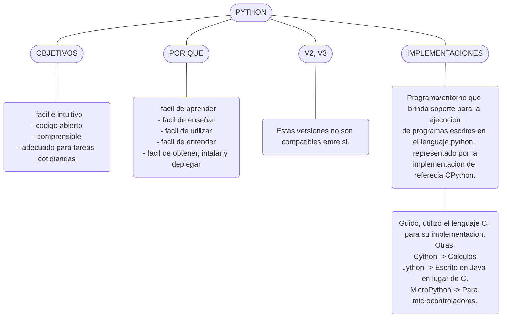
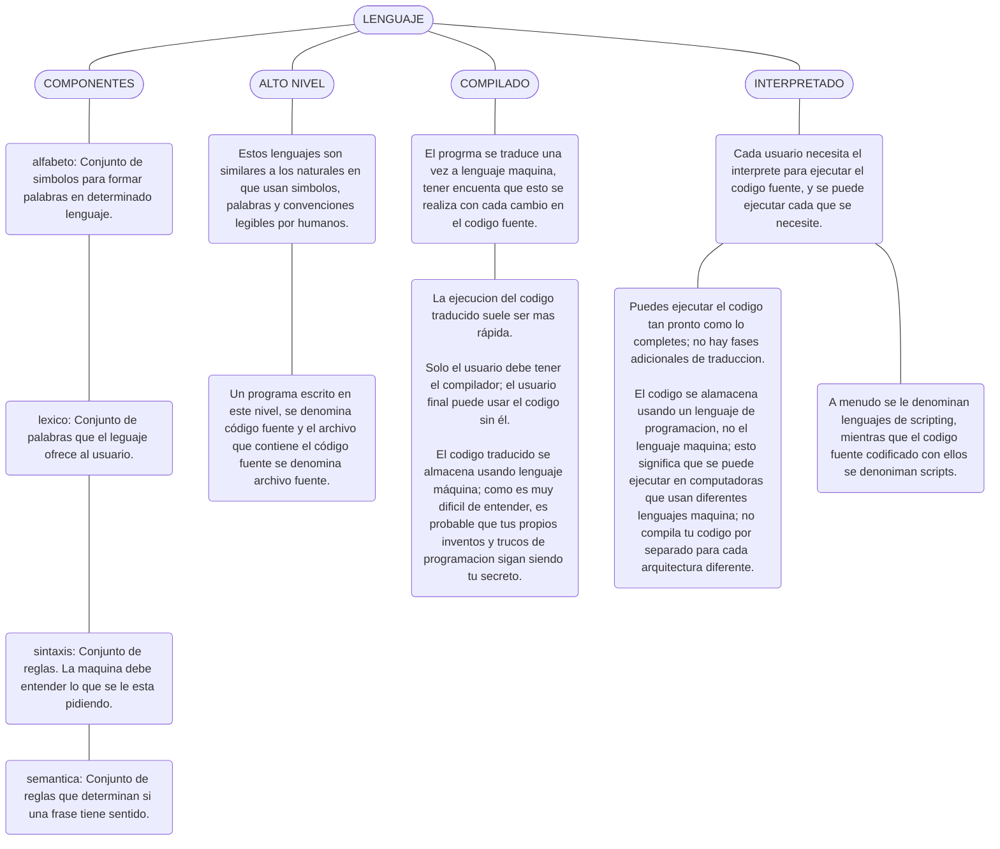

# PYTHON

Python es un leguaje de programación de alto nivel, interpretado, orientado a objetos y de uso generalizado con semántica dinámica, que se utiliza para la programación de propósito general.

:bulb: *Descargar el interprete de Python:* [URL](https://www.python.org/downloads/)



## *Componentes de un Leguaje:*




:pushpin: Rasgos

* Python3.6
  
  * A partir de esta versión se pueden agregar (_) en la separación de enteros literales/flotantes esto como una forma de visualizar mejor los valores. 1_932_54/3.45_234/2_300.40

  :pushpin: Operadores

* Prioridad: Es importante entender que los operadores tienen prioridad a la hora de realizar cálculos.
  
  * print(2 ** 2 ** 3) > 256

* enlace: si los operadores son iguales, el calculo se realiza de izquierda a derecha.

:pushpin: Funciones

* print():
  
  * \\(Barra invertida): Este se utiliza dentro de un string con el ámbito de indicar que el siguiente carácter es especial, se le conoce como carácter de escape.
  
  * ,(coma): Esta se utiliza para separar argumentos, al utilizarse en la función, esta agrega automáticamente un espacio en blanco.
  
  * Argumento posicional: Significa que el orden en que pasas los argumentos importa. la función interpreta cada valor según su posición.
  
  * Argumentos de palabra clave(cualquier argumento de palabra clave debe colocarse **después del último argumento posicional** (esto es muy importante)): Los **argumentos de palabra clave** se pasan a una función **especificando el nombre del parámetro**, seguido por un signo igual `=`, y luego el valor. esto permite modificar el comportamiento de una función.
    
    * Llamada usando **argumentos posicionales** (orden importa):
      
      ```python
      saludar("Ana", "Hola")
      # Resultado: Hola An
      ```
    
    * Llamada usando **argumentos de palabra clave** (orden NO importa):
      
      ```python
      saludar(nombre="Ana", mensaje="Hola")
      # Resultado: Hola Ana
      ```
    
    * :round_pushpin:Palabras clave
      
      - end="": podemos indicar que acción realizar al finalizar.
      
      - sep="": podemos indicar que realizar con los espacios asignador por el separador de argumentos.

      :pushpin: Tipos de datos

* Enteros:
  
  * Estos pueden ser representados en 
    decimal(10), octal(8) o hexadecimal(16).

* Flotantes:
  
  * Estos son números que cuentan con una parte fraccionaria. que va precedida de un (.) no puede ser una (,) esto nos daría error.
  
  * Podemos omitir un el 0 antes o el 0 después solo agregando un (.), ejemplo de 0.4 es .4 y de 4.0 es 4.
  
  * Se pueden representar en notación científica. (E/e) ambos representan lo mismo. a = 1e3   # 1 × 10³ = 1000.0

* String:
  
  * Estos pueden ser asignados con ''/""
    
    * Se puede hacer esto "'" o esto '"jefferson"'

* Booleans:
  
  * True/False 1/0

* NoneType:
  
  * None
  
  * el literal `None`. Este literal es llamado un objeto de `NoneType`, y puede ser utilizado para representar **la ausencia de un valor**. Pronto se hablará más acerca de ello

  :pushpin: Términos

* IL(instruction list): Lista de instrucciones.

* Código fuente: Es el texto que escribimos en un lenguaje.

* Archivo fuente: Es el archivo donde anexamos el código fuente.

* Lenguaje alto nivel: Es el lenguaje que se parece mas al humano.

* Lenguaje bajo nivel: Es el lenguaje que se parece mas a la maquina.

* Compilado: El código fuente debe ser traducido a código maquina antes de ejecutarse.

* Interpretado: El código se lee y ejecuta inmediatamente línea por línea. a estos lenguajes se les conoce como **lenguajes de scripting** y los archivos fuente codificados con estos lenguajes se conocen como **scripts**

* Implementación(CPython): Esto hace referencia a que python no solo cuenta con una única forma de correr python también existen por decirlo así otras alternativas que pueden hacer mas eficiente python. 

* IDLE(Integrated Development and Learning Environment): Desarrollo Integrado y Entorno de Aprendizaje.

* literal: un **literal** es un valor **fijo** que se escribe directamente en el código fuente y que representa un tipo de dato básico como un número, una cadena de texto, un valor booleano, etc.

* Octal: Los **números octales** son una forma de contar, igual que los números normales (decimales), pero solo usan los **números del 0 al 7**. en Python se representan con 0o\<octal>

* Hexadecimal: Un número **hexadecimal** es un número en **base 16**.  
  Eso quiere decir que, en lugar de contar solo del **0 al 9**, también usamos letras para representar los números del **10 al 15**:
  0, 1, 2, 3, 4, 5, 6, 7, 8, 9, A, B, C, D, E, F

* redondeo hacia abajo: El **redondeo hacia abajo** significa que tomas un número **y lo conviertes en el entero más cercano que sea menor o igual a él**. -1.1 = -2 / 2.5 = 2
  
  * Cuando el número es negativo, **"menor" significa más a la izquierda en la recta numérica**, es decir, **más negativo**.
