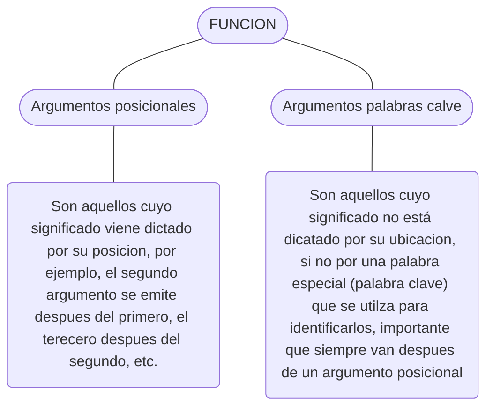

## FUNCIONES

una **función** es un bloque de código que realiza una tarea específica y que puedes reutilizar varias veces dentro de un programa.

:old_key: *Funciones predefinidas/incorporadas por el lenguaje:* [URL](https://docs.python.org/3/library/functions.html)



:key: *Sintaxis:*

```python
'''
parametro = valor | esto establece un valor por default
tipoDato = tipodato | se conoce como "hint" y esto solo indica el 		tipo de dato que retorna la funcion.
return valor = se encarga de retornar un resultado cuando se agrega 	implicitamente.
*args (Argumentos variables) = se suele utilizar esta forma cuando 		desconocemos la cantidad de argumentos que puede recibir la 		funcion este *args se convierte en tupla. 
**kwars () = Este recibe un diccionario clave='valor'
'''

def nom_funcion(parametro = valor, *args, **kwars) -> tipoDato:
    # cuerpo funcion
    return valor

nom_funcion(clave='valor', clave=valor) # pasando clave=valor

diccionario = {
    'clave': 'vaor',
    'clave': valor
}
nom_funcion(diccionario) # pasando el diccionario
```

:bulb: ​ *yield*

`yield` es una palabra clave en Python que se usa dentro de una función para crear un **generador**. A diferencia de `return`, `yield` no termina la ejecución de la función, sino que **pausa** su estado y permite retomarlo más adelante.

```python
def contar_hasta(n):
    """Generador que cuenta del 1 al n."""
    for i in range(1, n + 1):
        yield i  # Pausa la función y devuelve el valor

# Crear el generador
contador = contar_hasta(5)

# Obtener valores con next()
print(next(contador))  # 1
print(next(contador))  # 2
print(next(contador))  # 3

# También se puede usar en un bucle for
for numero in contar_hasta(5):
    print(numero)  # Imprime 1, 2, 3, 4, 5


''' Explicación:
- yield, devuelve un valor y pausa la ejecución.

- La próxima vez que se llame a next(), la función 
continúa desde donde se quedó.

- Si se usa en un for, automáticamente se 
itera sobre los valores generados.
'''
```

##  FUNCIONES RECURSIVAS

Son funciones que se mandan a llamar así mismas para completar cierta tarea.

:warning: **Regla importante:** Debe tener un **caso base** para evitar una recursión infinita.

```python
# Sintaxis:
def nom_funcion(param):
    # caso base (condicion de salida)
    if condicion_de_parada:
        return valorBase

    # Llamada recursiva
    return nom_funcion(nuevo_parametro)

# Ejemplo:
def factorial(n):
    # Caso base
    if n == 0:
         return 1
    else:
        # Llamada recursiva
        return n * factorial(n - 1) # el balor se pasa a la funcion

# Llamando a la función
print(factorial(5))  # Salida: 120

''' Explicación:
Caso base: Es una condición que detiene las llamadas recursivas, 
evitando que la función se llame indefinidamente.

Llamada recursiva: La función se llama a sí misma 
con nuevos parámetros, reduciendo el problema hasta llegar al caso base.

Funcionamiento:

factorial(5) llama a factorial(4),  
factorial(4) llama a factorial(3),  
Y así sucesivamente, hasta que llega a factorial(0), donde devuelve 1.

La función recursiva se va "desenrollando" y 
multiplica los resultados hasta obtener el valor final.
'''
```

## FUNCIONES LAMBDA

Las **funciones lambda** en Python son funciones anónimas o pequeñas que se definen en una sola línea usando la palabra clave `lambda`.

Son útiles cuando necesitas una función corta y rápida sin definirla con `def`. Si estás trabajando con una sola expresión en línea.

```python
# Sintaxis:
lambda argumentos: expresión

# Ejemplo
numbers = [1, 2, 3, 4, 5]

even_numbers = list(filter(lambda x: x % 2 == 0, numbers))
print(even_numbers)  # [2, 4]
```

* No es una buena práctica asignar una función lambda a una variable, de ser necesario definir una funcion con `def`
* Evitar crear funciones lambda que sean difíciles de leer o innecesariamente complicadas

:round_pushpin: map()

La función **`map()`** se usa para aplicar una función a **cada elemento** de un iterable (como listas o tuplas) y devuelve un **iterador** con los resultados.

```python
# Sintaxis:
map(funcion, iterable)

# Ejemmplo:
numeros = [1, 2, 3, 4, 5]
dobles = list(map(lambda x: x * 2, numeros))
print(dobles)  # Salida: [2, 4, 6, 8, 10]
```

:round_pushpin: filter()

La función **`filter()`** se usa para **filtrar** elementos de un iterable **según una condición**. Solo se conservan los elementos donde la función retorna `True`.

```python
# Sintaxis:
filter(funcion, iterable)

# Ejemplo:
numeros = [1, 2, 3, 4, 5, 6, 7, 8, 9, 10]
# Aquí, lambda x: x % 2 == 0 filtra solo los números pares.
pares = list(filter(lambda x: x % 2 == 0, numeros))
print(pares)  # Salida: [2, 4, 6, 8, 10]
```

## FUNCIONES PREDEFINIDAS

* `round(objeto, ndcimales)` redondea un numero a unumero especifico de lugar de decimales. Por defecto, esta funcion redondea al entero mas cercano y devuelve un numero entero sin decimales.

  ```python
  num = 1.6
  print(round(num))
  # >>> 2
  #! IMPORTANTE el redonde aplica apartir del 6
  ```

* `abs()` Devuelve el valor absoluto de un numero, es decir sin el signo.

  ```python
  num = -8
  print(abs(num))
  # >>> 8
  ```

* `pow(base, exponente, opc-modulo)` Elevar un numero a una potencia

  ```python
  # (base ** exponente) % modulo
  print(pow(2, 3, 5)) # (2 ** 3) % 5
  # >>> 3
  ```

* `maketrans()` Crea una tabla de traduccion, es como un diccionario especial que dice, esta letra se cambia por esta letra.

  ```python
  '''
  toma dos cadenas de igual longitud y devuelve 
  una tabla de traducción que asigna cada carácter 
  de la primera cadena con el carácter correspondiente 
  de la segunda cadena
  '''
  tabla = str.maketrans("aeiou", "12345")
  ''' Esto es lo que esta sucediendo
  a → 1
  e → 2
  i → 3
  o → 4
  u → 5
  '''
  ```

  * se utiliza en conjunto con `translate()` **aplica una tabla de traducción a una cadena de texto**, reemplazando o eliminando caracteres según las reglas definidas.

    - `maketrans()` 👉 **define las reglas**

    - `translate()` 👉 **ejecuta las reglas**

```python
texto = "hola mundo"
print(texto.translate(tabla))
# >>> h4l1 m5nd4
```

* `range()` Esta funcion se utiliza para generar una secuencia de enteros.

  ```python
  """
  start: por defecto viene en 0 que indica desde donde
  queremos comenzar la secuencia de numeros.
  stop: indica hasta donde generar numeros, esto sin
  incluir el numero final, es decir si es 5 solo iria
  hasta el .
  step: indica de cuanto en cuanto realizar el 
  incremento a la secuencia.
  """
  range(start, stop, step)
  
  for num in range(2, 11, 2):
      print(num)
  
  # >>> 2, 4, 6, 8, 10
  ```

  * Si no se proprocionan argumentos esta devolvera un TypeError.
  * Esta funcion solo recibe enteros, si asignamos flotantes esta nos devolvera un `TypeError`
  * Tambien se puede lograr una secuencia decreciente, con el step en negativo y un start en positivo.

* `enumerate(iterable, start=n)` Esta funcion se encarga de llevar un contador ya sea de una (lista, tupla, string) generando un objeto que contiene tuplas.

```python
 """
iterable: acemos referencia a la coleccion de datos
lista, tupla, string.
start=n: Indicamos en que numero debe empezar el
contador.
"""
enumerate(iterable, start=0)

frutas = ['manzana', 'banana', 'naranja']

for indice, fruta in enumerate(frutas):
    print(f"{indice}: {fruta}")

# Salida:
# 0: manzana
# 1: banana
# 2: naranja
```

* `zip()` Permite combinar dos o más iterables (listas, tuplas, etc.) elemento por elemento, creando tuplas con los elementos correspondientes de cada iterable.

  ```python
  zip(iterable1, iterable2, ...)
  ```

  * `zip()` toma elementos de la misma posición de cada iterable y los agrupa en tuplas. Se detiene cuando el iterable más corto se agota.

  ```python
  nombres = ['Ana', 'Luis', 'Carlos']
  edades = [25, 30, 22]
  
  for nombre, edad in zip(nombres, edades):
      print(f"{nombre} tiene {edad} años")
  
  # Salida:
  # Ana tiene 25 años
  # Luis tiene 30 años
  # Carlos tiene 22 años
  ```
